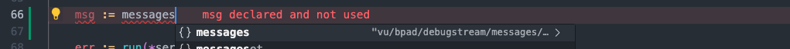

# Messaging Definitions

> [!IMPORTANT]  
> This repository should be included in modules and utilities as a *Git submodule*. The code cannot be run on itself.

The messaging definitions are the backbone of all communication between car control processes. This does not only include inter-process communication on the car itself but also communication over the network (for example, sending a livestream frame from the car to a connected client). 

The messaging definitions are just that: *definitions*. They are defined as protobuf definitions which can be compiled to actual code in any language you like. **Remember**: you should not push any code that was generated or compiled based on these protobuf definitions: they should be recompiled at build time.

Basic compilation scripts for both Go and TypeScript are provided. Documentation can be found below.

## Basic file structure

There are two main folders: 

- *definitions*: contains all the protobuf definitions of the messages that can be exchanged. Changes to these files should be pushed to git.
- *gen*: code that was generated (compiled) based on the protocol definitions. Don't push this code.

## Compiling definitions

Before you can compile to any language, make sure to install `protoc`, the protobuf compiler. You can find pre-compiled binaries [here](https://github.com/protocolbuffers/protobuf/releases) (or you can install from your favorite package manager, such as `apt` or `brew`).

### Compiling to Go

#### Requirements

- Go should be installed (duh)
- The Go protocol buffer plugin should be installed
- The Go protobuf package should be installed

You can install the plugin and go package using our installation script:
```bash
# make the script executable
chmod +x install-go.sh 
# execute the script
./install-go.sh
```

#### Compilation

We have done the hard work for you. Just run the `generate-go.sh` script. As with the installation script, you can make the compilation script executable by running `chmod +x generate-go.sh`

The Go files will be generated under the *messages* module (in the *gen* folder) so **make sure that you export no other modules with this name** as you will get import conflicts. If your IDE is set up correctly for Go linting and IntelliSense, it will help you resolve the import path automatically, as shown below:



### Compiling to TypeScript

#### Requirements

- npm should be installed (duh)
- the TypeScript compilation plugin should be installed

You can install the plugin by using our installation script:
```bash
# make the script executable
chmod +x install-ts.sh 
# execute the script
./install-ts.sh
```

#### Compilation

Like compilation for Go, you can just use our compilation script by executing `./generate-ts.sh` (you should know how to make this executable by now). 

The TypeScript files will not be exported under any module. You can just import the files by referencing the relative path to the *gen* folder. If your IDE is set up correctly for TS/JS development, this will probably be done for you.